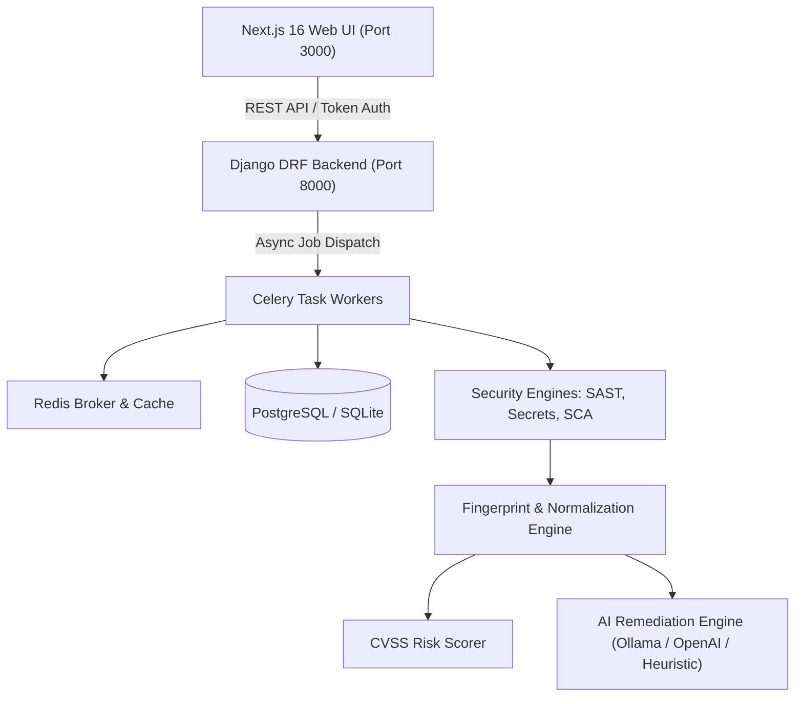

# CodeGuardian 🛡️

**CodeGuardian** is an enterprise-grade security and vulnerability remediation platform designed for AI-generated and modern software codebases. It combines AST-based Static Application Security Testing (SAST), high-entropy Secret Detection, Software Composition Analysis (SCA), and contextual AI remediation into an integrated developer experience.

---

## 🏛️ System Architecture



---

## ⚡ One-Command All-in-One Runner (Recommended)

Run the **entire platform** (Backend API, Celery Workers, Database check, and Next.js Frontend) concurrently with unified logs and automatic cleanup:

```bash
# Windows (PowerShell):
.\start_dev.ps1

# Windows (Command Prompt / Double-Click):
start_dev.bat

# Python (Cross-Platform):
python run_all.py

# Optional flags:
python run_all.py --worker    # Also launch Celery background worker
python run_all.py --setup     # Auto-run migrations & seed demo data first
python run_all.py --build     # Build frontend production bundle
```

---

## 🐳 Docker Compose (Full-Stack Containerized)

```bash
docker compose up --build
```
This boots PostgreSQL, Redis, Django API, Celery Worker, and Next.js Frontend in isolated containers.

---

## 🛠️ Manual Step-by-Step Setup

### 1. Backend Setup

```bash
cd backend

# Activate virtual environment
..\.venv\Scripts\activate  # Windows
# source ../.venv/bin/activate  # Linux/macOS

# Install dependencies
pip install -r requirements.txt

# Run migrations
python manage.py migrate

# Seed initial demo tenant, users, and vulnerability catalog
python manage.py seed_demo

# Start Django development server (Port 8000)
python manage.py runserver 127.0.0.1:8000
```

---

### 2. Frontend Setup

```bash
cd frontend

# Install dependencies
npm install

# Copy environment variables
cp .env.example .env.local

# Run Next.js dev server (Port 3000)
npm run dev
```

Open [http://localhost:3000](http://localhost:3000) in your browser.

---

## 🔑 Demo Credentials

| Role | Email | Password |
|---|---|---|
| Platform Admin | `admin@codeguardian.io` | `GuardianPass123!` |

---

## 📋 Platform Capabilities

1. **GitHub Repository Scanning**
   - Direct repository URL onboarding with branch selection and customizable profiles (`quick`, `standard`, `deep`).
2. **Multi-Engine Security Scanners**
   - **AST & Semantic SAST**: Detects SQL injections, hardcoded credentials, unsafe deserialization, command injections, and path traversals.
   - **Secret Detection**: High-entropy regex scanners detecting AWS tokens, GitHub PATs, JWTs, and private keys.
   - **Software Composition Analysis (SCA)**: Checks dependencies against known CVE databases.
3. **Live Pipeline Observability**
   - Visual stages displaying sandbox provisioning, static analysis, normalizer deduplication, and risk scoring.
4. **Interactive Vulnerability Triage**
   - Severity filtering (Critical, High, Medium, Low).
   - Lifecycle state transitions (`OPEN`, `FIX_IN_PROGRESS`, `FIXED`, `FALSE_POSITIVE`, `ACCEPTED_RISK`).
   - Line-numbered code snippet viewer highlighting vulnerable code contexts.
5. **Contextual AI Remediation**
   - Automated threat modeling, attack vector scenario explanation, and copy-pasteable remediation patches.
6. **Executive Audit Reports**
   - Standalone compliance HTML export and machine-readable JSON reports.
